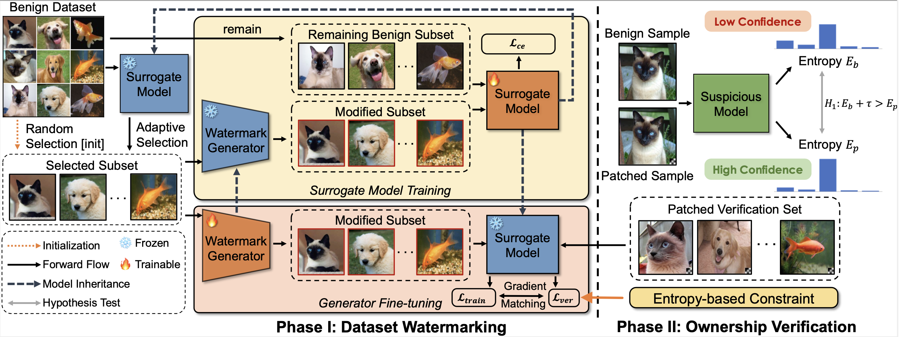

# [CVPR 2025] EntropyMark

This is the official implementation of our paper ["EntropyMark: Towards More Harmless Backdoor Watermark via Entropy-based Constraint for Open-source Dataset Copyright Protection"](), CVPR 2025.

## Citation

Please cite our paper in your publication if it helps your research:

@inproceedings{sun2025entropymark,
  title={EntropyMark: Towards More Harmless Backdoor Watermark via Entropy-based Constraint for Open-source Dataset Copyright Protection},
  author={Sun, Ming and Wang, Rui and Zhu, Zixuan and Jing, Lihua and Guo, Yuanfang},
  booktitle={Proceedings of the Computer Vision and Pattern Recognition Conference},
  pages={30692--30701},
  year={2025}
}

## Main Pipeline



## Setup

### Environments

This project is developed with Python 3.6 and Pytorch, on Ubuntu 18.04. Please run the following script to install the required packages:

```shell
pip install -r requirements.txt
```

### Datasets

The original datasets for CIFAR-10, ImageNet-12, and MNIST are available on [Google Drive](https://drive.google.com/drive/folders/1pybwzXsLifPQOYQCnMeECtvVDk9_qiIm?usp=sharing).

### results

Our experimental results and trained models for CIFAR-10, ImageNet-12 and MNSIT are available on [Google Drive](https://drive.google.com/drive/folders/1FZQk_x94caNeCV3PDAE8dcNhc8P_ocDI?usp=sharing).

## Usage

### Path Setting

1. Define the paths for different datasets in the `define_dataset` function of `utils.py`.

2. Set the result save path using the `save_dir` hyperparameter in `main.py`.

### Key Hyper-parameters Setting

1. Define the structure of the surrogate model and the actual model using the `model` and `surrogate_model` hyperparameters in `main.py`.

2. Set the training dataset using the `dataset` hyperparameter in `main.py`.

3. For other hyperparameters, please refer to the instructions in `main.py`.

### Running

```shell
python main.py
```

**Note**: Hyperparameter settings vary across datasets. Please refer to the code comments for details.

## Acknowledgments

We built our codes based on [BackdoorBox](https://github.com/THUYimingLi/BackdoorBox) and [UBW](https://github.com/THUYimingLi/Untargeted_Backdoor_Watermark). Thanks for their excellent work!
